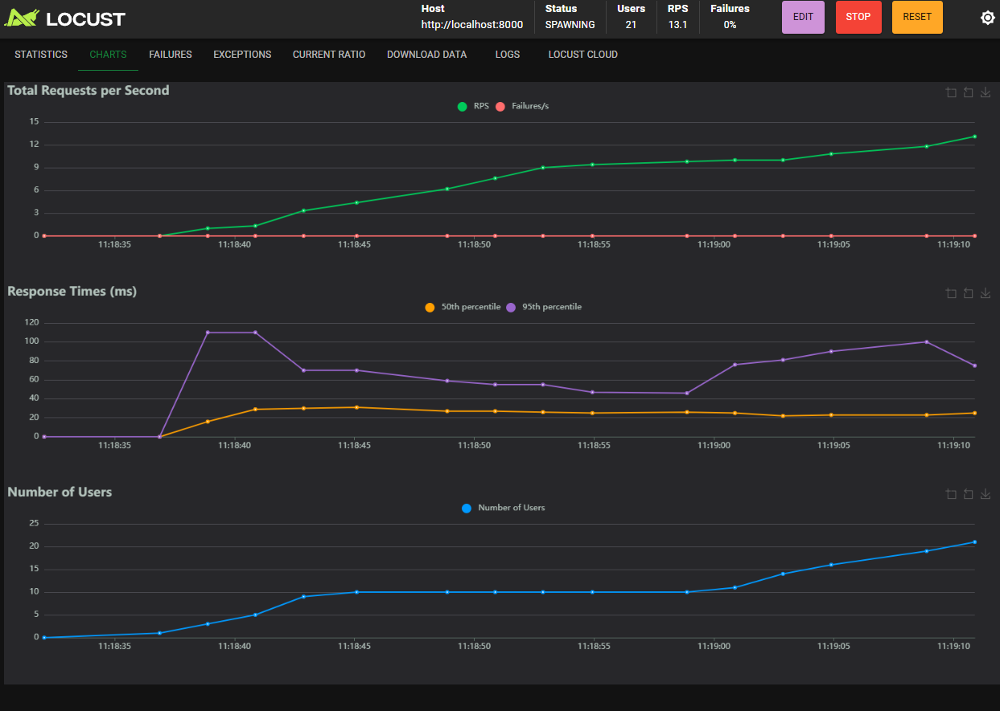

# Описание системы <br/>
БД состоит из 2 таблиц

Таблица device

| Поле | Тип      |
|---|----------|
|id | Integer  |
|name| String   |

Таблица measure

| Поле      | Тип      |
|-----------|----------|
|id| Integer  |
|x| Float    |
|y| Float    |
|z| Float    |
|time_stamp| DateTime |
|device_id| Integer  |

Описание эндпоинтов API:
1. Добавления статистики устройства. Принимает данные статистики, если отсутствует устройство, то создает его. <br/>
Метод: POST <br/>
URL: /devices/{device_id}/measures/ <br/>
Тело запроса: Принимает параметры x, y, z <br/>
Пример запроса: <br/>
```
curl -X POST "http://127.0.0.1:8000/devices/1/measures/" -H "Content-Type: application/json" -d "{\"x\": 1.23, \"y\": 4.56, \"z\": 7.89}"
```
2. Анализ собранной статистики с устройства за определённое время и за всё. <br/>
Метод: GET <br/>
URL: /devices/1/status/?start_time&end_time <br/>
Пример запроса <br/>
```
curl -X 'GET' 'http://127.0.0.1:8000/devices/1/status/?start_time=2023-01-01T00:00:00&end_time=2026-01-02T00:00:00'
```

Запуск программы

```
git clone https://github.com/ilfeza/statisticsService
``` 
```
cd statisticsService
``` 
```
docker-compose up --build
```

### Результат тестирования

